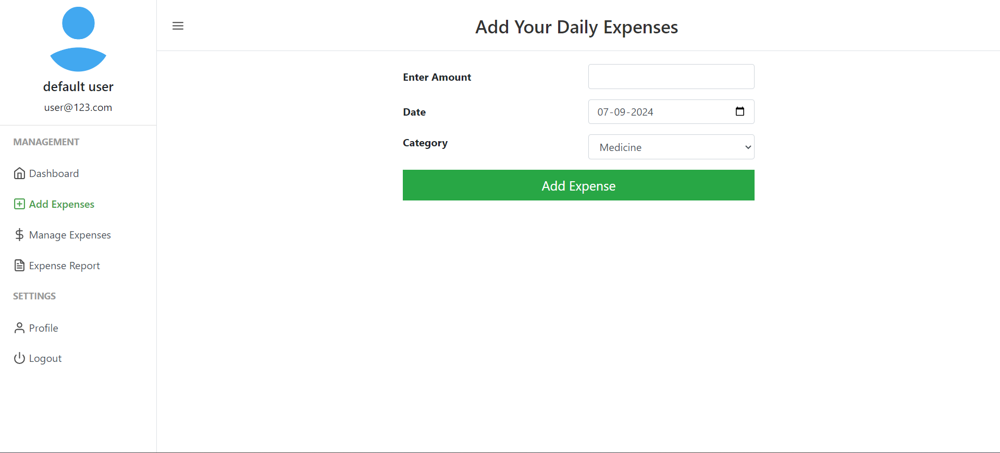
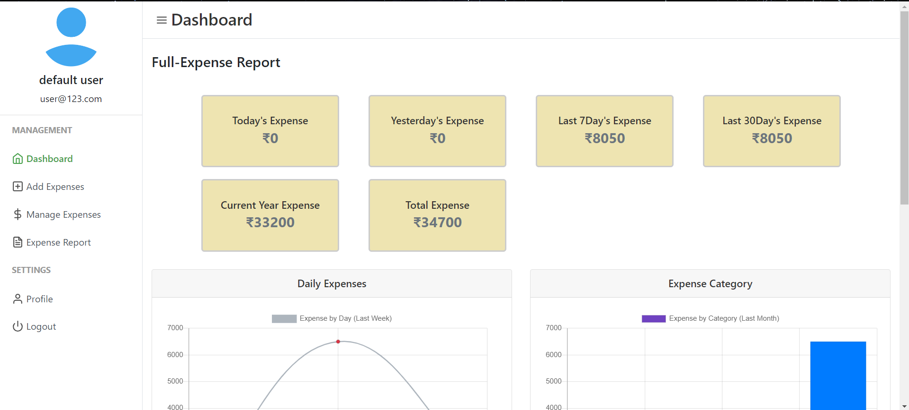
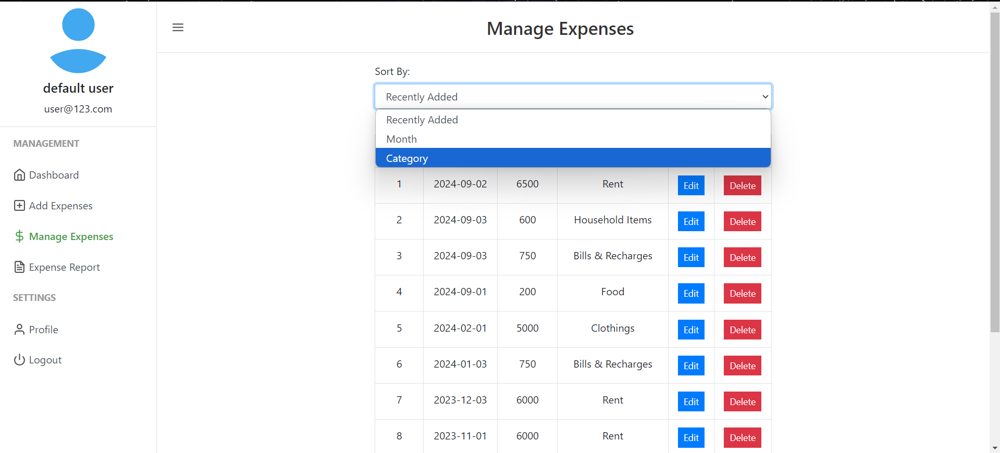
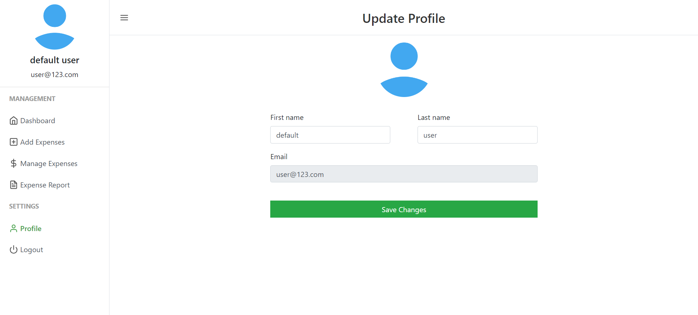

# Personal Expense Tracker

The Expense Tracking Database Management System `DBMS` project is a user-friendly application that allows multiple users to sign up, log in, and easily manage their personal expenses in different categories. Users can add, view, and delete expenses, making it simple to track their spending. The system also allows users to sort expenses by month and category, giving them a clear view of their spending patterns. Additionally, the DBMS generates detailed reports of expenses on a daily, monthly, and yearly basis, helping users make smart financial decisions. This project makes expense tracking easy and improves financial management for everyone.
## Installation

1. **Download and Install XAMPP :**
   - Go to [https://www.apachefriends.org/index.html](https://www.apachefriends.org/index.html) and download XAMPP.

2. **Start XAMPP :**
   - Open the XAMPP control panel.
   - Start the Apache and MySQL services.

3. **Access `htdocs` Directory :**
   - In your XAMPP installation directory, navigate to the `htdocs` folder.
   - This is where you'll place your web projects.

4. **Fork and Clone the Repository :**
   - Fork the repository to your GitHub account by clicking the "Fork" button at the top right of the repository page.
   - Open a terminal or command prompt.
   - Navigate to the `htdocs` directory in your XAMPP installation folder:
     ```bash
     cd /path/to/xampp/htdocs
     ```
   - Clone the forked repository from your account:
     ```bash
     git clone https://github.com/EbeyJoeRegi/Personal-Expense-Tracker.git
     ```

5. **Setting up the Database :**
   - Open phpMyAdmin by going to `http://localhost/phpmyadmin` in your browser.
   - Log in using the default credentials ( username: `root`, no password by default ).
   - Create a new database:
     - Click on "Databases" in the top menu.
     - Enter a name for the database - `dailyexpense` and choose the appropriate collation ( usually `utf8_general_ci` ).
     - Click "Create".
   - Import the SQL file from the repository:
     - Click on the newly created database from the left sidebar.
     - Choose "Import" from the top menu.
     - Click "Choose File" and select the SQL file provided in the repository.
     - Click "Go" to import the data into the database.

## Usage

1. **Access the Project :**
   - Open your browser and type `http://localhost/repository-folder-name` to access the project.
   - Replace `repository-folder-name` with the name of the folder created during the cloning process (By default : `DailyExpense-System`).
   
2. **Default Login Credentials**

   - Upon accessing the web application for the first time, use the following default login credentials:
     - **Email** : user@123.com
     - **Password** : 1234

3. **Work on the Project:**
   - Any changes made within the cloned repository will reflect on the localhost URL (e.g., `http://localhost/Spendr`).
   
4. **Manage XAMPP Services:**
   - Use the XAMPP control panel to start/stop Apache, MySQL, and other services as needed.

---

## Add Expense Page


## Dashboard Page


## Manage Expense Page


## Profile Page


